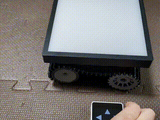
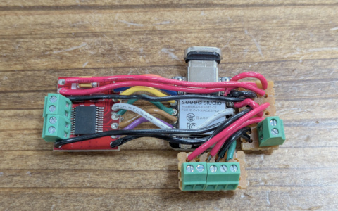

# Overview / 概要

This project implements a crawler robot that receives movement commands via [ESP-NOW protocol](https://www.espressif.com/en/solutions/low-power-solutions/esp-now) and displays animated directional arrows on a 16x16 LED dot-matrix.

\[日本語\]

このプロジェクトでは、[ESP-NOWプロトコル](https://www.espressif.com/en/solutions/low-power-solutions/esp-now) を介して移動コマンドを受信し、16x16 LED ドットマトリックスにアニメーション化された方向矢印を表示するクローラーロボットを実装します。



# Hardware Requirements / ハードウェア要件

## Components / コンポーネント

- Microcontroller: [Seeed Studio XIAO ESP32-C6](https://wiki.seeedstudio.com/xiao_esp32c6_getting_started/)
- Motor Driver: [Toshiba TB6612FNG dual motor driver](https://aliexpress.com/item/1005005973846875.html)
- Crawler Kit: [TP101](https://ja.aliexpress.com/item/1005002052435803.html)
- Dot-Matrix Display: [16x16 WS2812B LED dot-matrix panel](https://aliexpress.com/item/4000544584524.html)
- Rechargeable Ni-MH AA Battery x 4 (4.8V)

\[日本語\]

- マイクロコントローラー: [Seeed Studio XIAO ESP32-C6](https://wiki.seeedstudio.com/xiao_esp32c6_getting_started/)
- モータードライバー: [東芝 TB6612FNG デュアルモータードライバー](https://aliexpress.com/item/1005005973846875.html)
- クローラーキット: [TP101](https://ja.aliexpress.com/item/1005002052435803.html)
- ドットマトリックスディスプレイ: [16x16 WS2812B LEDドットマトリックスパネル](https://aliexpress.com/item/4000544584524.html)
- ニッケル水素充電池 x 4 (4.8V)

## Pin Connections / ピン接続

| XIAO ESP32-C6 Pin | TB6612FNG Pin  | dot-matrix display Pin  | Battery Pin |
| ----------------- | -------------- | ----------------------- | ----------- |
| D0                | PWMA           | -                       | -           |
| D1                | AIN2           | -                       | -           |
| D2                | AIN1           | -                       | -           |
| D3                | BIN1           | -                       | -           |
| D4                | BIN2           | -                       | -           |
| D5                | PWMB           | -                       | -           |
| D7                | -              | DIN                     | -           |
| D8                | -              | -                       | -           |
| D9                | -              | -                       | -           |
| D10               | STBY           | -                       | -           |
| 3V3               | VCC            | -                       | -           |
| GND               | GND            | GND                     | GND         |
| VBUS              | -              | -                       | VBAT        |
| -                 | VM             | -                       | VBAT        |
| -                 | -              | 5V                      | VBAT        |



# Software Requirements / ソフトウェア要件

## Dependencies / 依存ライブラリ

- [FastLED](https://github.com/FastLED/FastLED) - LED dot-matrix control
- [LovyanGFX](https://github.com/lovyan03/LovyanGFX) - Graphics rendering

\[日本語\]

- [FastLED](https://github.com/FastLED/FastLED) - LEDドットマトリクス制御
- [LovyanGFX](https://github.com/lovyan03/LovyanGFX) - グラフィックスレンダリング

# Project Structure / プロジェクト構成

```
dotmatrix_crawler_robot/
├── src/
│   └── main.cpp                    # Main program logic
├── include/
│   ├── constants.h                 # Pin definitions and configuration
│   ├── motor_controller.hpp        # Motor control interface
│   ├── led_display.hpp             # LED dot-matrix display interface
│   ├── animation_controller.hpp    # Animation manager
│   └── arrow_images.h              # Pregenerated arrow image data
├── platformio.ini                   # PlatformIO configuration
└── README.md                        # This file
```

\[日本語\]

```
dotmatrix_crawler_robot/
├── src/
│   └── main.cpp                    # メインプログラムロジック
├── include/
│   ├── constants.h                 # ピンの定義と設定
│   ├── motor_controller.hpp        # モーター制御インターフェース
│   ├── led_display.hpp             # LEDドットマトリックスディスプレイインターフェース
│   ├── animation_controller.hpp    # アニメーション管理
│   └── arrow_images.h              # 事前生成された矢印画像データ
├── platformio.ini                   # PlatformIO 設定
└── README.md                        # このファイル
```

# License / ライセンス

Copyright (C) 2025, cubic9com All rights reserved.

This project is licensed under the MIT license.

See the `LICENSE` file for details.
